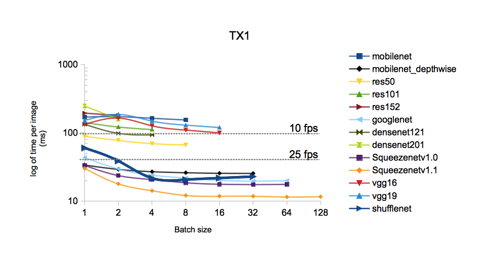
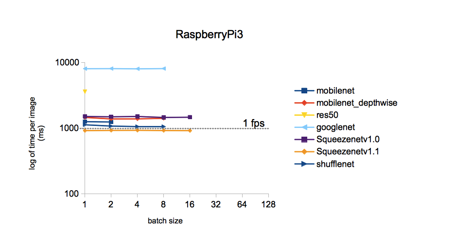
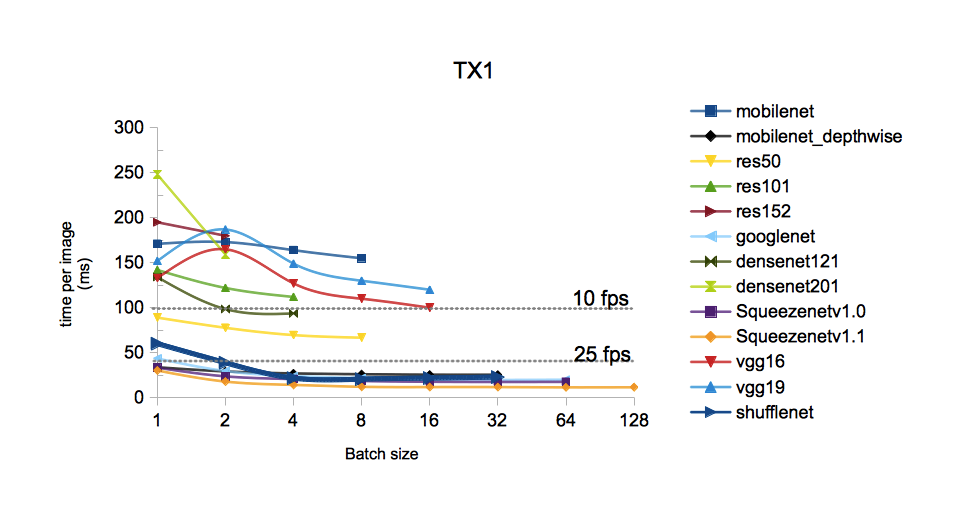
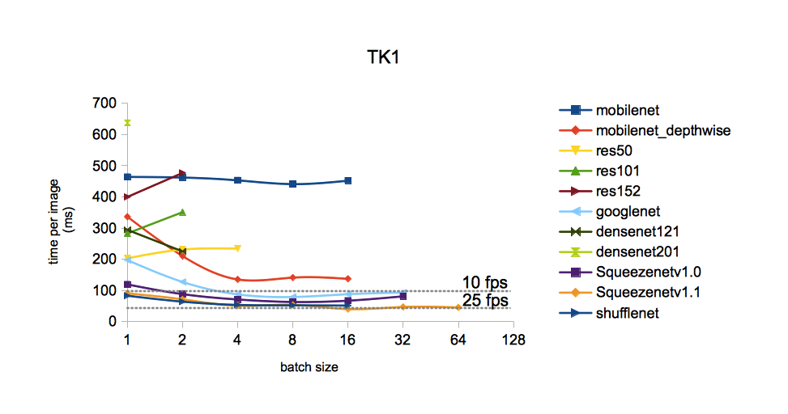
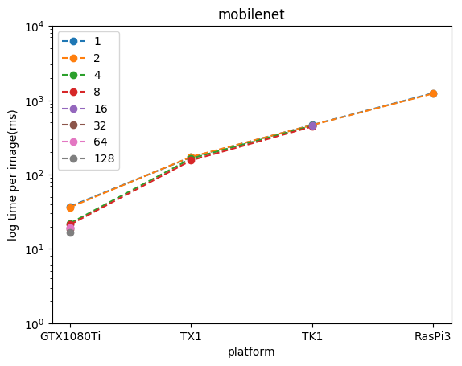
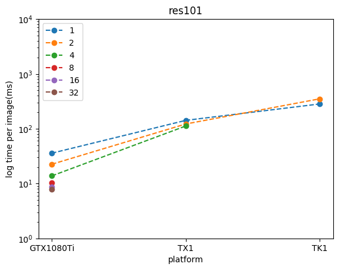
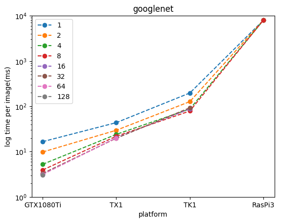

# dd\_performances
#### DeepDetect performance sheet:

DeepDetect is also capable of running on multiple platform.
We conducts an experiment with multiple contemporary Neural Network(NN) models.--shuffleNet, mobileNet depthwise etc. --
Given different platform, the result would serve as a refference for those interested in choosing NN model for their work on their embedded system.

Below are performances, displayed in log scale

<table style="width=100%">
  <tr>
     <th></th>
     <th></th>
  </tr>
</table>
<table style="width=100%">
  <tr>
     <th></th>
     <th></th>
  </tr>
</table>

### general discussion of NN network models:


### in search for a better model for embedded system:

The challenge of implementing NN on an embedded system is the limitation on computational resources. The model should be lean and mean... 
That is to say it should be smaller without losing the accuracy. We looked into <a href = https://github.com/shicai/MobileNet-Caffe >Mobilenet</a>.

Mobilenet is an implementation of <a href = https://arxiv.org/abs/1704.04861>google's mobilenet</a>. 
Mobilenet has Top-1 accuracy of 70.81% and Top-5 accuracy of 89.5% compared to the leading model in accuracy, 
Densenet201, with 77.31% for Top-1 and 93.64% for Top-5. The mobile have shown minimal lost in accuracy while reducing the footprint from 4.7 Gflops to 0.56 Gflops.

But the result was rather underwhelming. While faster than densenet201, the mobilenet is nowhere near the leading models in term of speed.
  

#### implementation of mobilenet\_deptwise: 
The problem lies in how caffe deal with group convolution... how?
We implemented the mobilenet\_deptwise convolution and observe improvement across the board exept on Raspberry Pi3.. why?

#### in the search for a better candidate, shufflenet:
The <a href = https://arxiv.org/pdf/1707.01083.pdf>shufflenet</a> promised a more efficient NN... how?


<table style="width=100%">
  <tr>
     <th></th>
     <th></th>
  </tr>
</table>
<table style="width=100%">
  <tr>
     <th></th>
     <th></th>
  </tr>
</table>


#### Following section is for raw data and further discussion:

<details>
  <summary>raw data</summary>

### 5 pass average processing time(GTX 1080 Ti):
|Top 1 accuracy	|70.81	|missing	|75.3	|76.4	|77	|67.9	|74.9	|77.3	|59.5	|59.5	|70.5	|71.3	|missing|
| :---: | :---: | :---: | :---: | :---: | :---: | :---: | :---: | :---: | :---: | :---: | :---: | :---: | :---: |
|batch size	|mobilenet	|mobilenet\_depthwise	|res50	|res101	|res152	|googlenet	|densenet121	|densenet201	|Squeezenetv1.0	|Squeezenetv1.1	|vgg16	|vgg19	|shufflenet|
|1	|37.2	|12.2	|19.8	|35.8	|44.4	|16.6	|45.6	|69	|8.4	|8.6	|14	|14.6	|15	|
|2	|36.3	|6.2	|14.1	|22.5	|27.8	|9.8	|24	|38.6	|4.1	|5.5	|9.9	|11.2	|9.1	|
|4	|22.1	|4.3	|8.8	|13.8	|18.5	|5.25	|16.5	|25.9	|2.6	|3.55	|6.95	|8.2	|6.95	|
|8	|21.2	|3.52	|7.27	|10.4	|14.6	|3.93	|11.92	|18.5	|2.38	|2.33	|5.7	|6.25	|4.55	|
|16	|19.5	|3.73	|6.33	|8.63	|11.6	|3.18	|9.06	|13.7	|2.16	|1.97	|5.18	|6.21	|4.71	|
|32	|18.2	|3.23	|5.9	|7.82	|x	|3.3	|x	|x	|2.59	|2.96	|5.15	|6.05	|3.49	|
|64	|19.3	|3.12	|x	|x	|x	|3.13	|x	|x	|2.5	|2.33	|4.82	|5.63	|3.26	|
|128	|16.8	|2.63	|x	|x	|x	|3.05	|x	|x	|2.2	|2.2	|4.97	|5.57	|2.87	|

### 5 pass average processing time(Jetson TX1):
|Top 1 accuracy	|70.81	|missing	|75.3	|76.4	|77	|67.9	|74.9	|77.3	|59.5	|59.5	|70.5	|71.3	|missing|
| :---: | :---: | :---: | :---: | :---: | :---: | :---: | :---: | :---: | :---: | :---: | :---: | :---: | :---: |
|batch size	|mobilenet	|mobilenet\_depthwise	|res50	|res101	|res152	|googlenet	|densenet121	|densenet201	|Squeezenetv1.0	|Squeezenetv1.1	|vgg16	|vgg19	|shufflenet|
|1	|171	|33.8	|89	|142	|195	|43.6	|134	|248	|33.4	|30.2	|133	|152	|60	|
|2	|173	|29.2	|77.7	|122	|180	|29.6	|98.5	|159	|23.7	|17.9	|165	|187	|38.8	|
|4	|164	|27	|69.6	|112	|x	|24	|93.7	|x	|20.7	|14.2	|127	|149	|21.7	|
|8	|155	|26.1	|66.7	|x	|x	|21.8	|x	|x	|18.6	|12.1	|110	|130	|20.6	|
|16	|x	|25.6	|x	|x	|x	|20.2	|x	|x	|17.7	|11.8	|100	|120	|21.8	|
|32	|x	|25.5	|x	|x	|x	|19.7	|x	|x	|17.5	|11.8	|x	|x	|22.9	|
|64	|x	|x	|x	|x	|x	|20	|x	|x	|17.6	|11.5	|x	|x	|x	|
|128	|x	|x	|x	|x	|x	|x	|x	|x	|x	|11.6	|x	|x	|x	|

### 5 pass average processing time(Jetson TK1):
|Top 1 accuracy	|70.81	|missing	|75.3	|76.4	|77	|67.9	|74.9	|77.3	|59.5	|59.5	|70.5	|71.3	|missing|
| :---: | :---: | :---: | :---: | :---: | :---: | :---: | :---: | :---: | :---: | :---: | :---: | :---: | :---: |
|batch size	|mobilenet	|mobilenet\_depthwise	|res50	|res101	|res152	|googlenet	|densenet121	|densenet201	|Squeezenetv1.0	|Squeezenetv1.1	|vgg16	|vgg19	|shufflenet|
|1	|464	|336	|203	|283	|400	|197	|294	|637	|119	|90.2	|x	|x	|82.8	|
|2	|462	|210	|231	|351	|477	|127	|225	|x	|88	|71.3	|x	|x	|63.8	|	
|4	|453	|135	|234	|x	|x	|87.2	|x	|x	|70.8	|50.9	|x	|x	|53.4	|
|8	|441	|141	|x	|x	|x	|78.8	|x	|x	|62.9	|53.6	|x	|x	|52	|
|16	|452	|137	|x	|x	|x	|87.8	|x	|x	|67	|40	|x	|x	|51.3	|
|32	|x	|x	|x	|x	|x	|93	|x	|x	|81	|46.8	|x	|x	|x      |
|64	|x	|x	|x	|x	|x	|x	|x	|x	|x	|45.2	|x	|x	|x      |
|128	|x	|x	|x	|x	|x	|x	|x	|x	|x	|x	|x	|x	|x      |

### 5 pass average processing time(Raspberry pi 3):
|Top 1 accuracy	|70.81	|missing	|75.3	|76.4	|77	|67.9	|74.9	|77.3	|59.5	|59.5	|70.5	|71.3	|missing|
| :---: | :---: | :---: | :---: | :---: | :---: | :---: | :---: | :---: | :---: | :---: | :---: | :---: | :---: |
|batch size	|mobilenet	|mobilenet\_depthwise	|res50	|res101	|res152	|googlenet	|densenet121	|densenet201	|Squeezenetv1.0	|Squeezenetv1.1	|vgg16	|vgg19	|shufflenet|
|1	|1246	|1443	|3560	|x	|x	|7980	|x	|x	|1492	|910	|x	|x	|1115      |
|2	|1230	|1370	|x	|x	|x	|8008	|x	|x	|1478	|917	|x	|x	|1067      |
|4	|x	|1372	|x	|x	|x	|7943	|x	|x	|1493	|919	|x	|x	|1047      |
|8	|x	|1401	|x	|x	|x	|8015	|x	|x	|1444	|913	|x	|x	|1046      |
|16	|x	|x	|x	|x	|x	|x	|x	|x	|1456	|909	|x	|x	|x      |
|32	|x	|x	|x	|x	|x	|x	|x	|x	|x	|x	|x	|x	|x      |
|64	|x	|x	|x	|x	|x	|x	|x	|x	|x	|x	|x	|x	|x	|
|128	|x	|x	|x	|x	|x	|x	|x	|x	|x	|x	|x	|x	|x	|

### flops and params for each model:
|  | mobilenet |mobilenet\_depthwise |res50 |res101 |res152 |googlenet |densenet121 |densenet201 |Squeezenetv1.0 |Squeezenetv1.1 |vgg16 |vgg19 |shufflenet |
| :---: | :---: | :---: | :---: | :---: | :---: | :---: | :---: | :---: | :---: | :---: | :---: | :---: | :---: | 
| Giga flops	|0.5687 | 0.5514 | 3.8580 | 7.5702 | 11.282 | 1.5826 | 3.0631 | 4.7727 | 0.8475 | 0.3491 | 15.470 | 19.632 | 0.1234|
| million params | 4.2309 | 4.2309 | 25.556 | 44.548 | 60.191 | 6.9902 | 7.9778 | 20.012 | 1.2444 | 1.2315 | 138.34 | 143.65 | 1.8137 |


</details>

<details>
  <summary>Discussion</summary>

## on to platform independent topic
#### the computional constraint for each NN model 
- flops

One important aspect of choosing a model for your project is the limitation of the hardware, such as the computational output(flops), 
or the amount of RAM avialable. In this section we offer a comparision between the experimented models. 
The number of flops used for model is the theoretical minimum for requirement for the machine running it. 
Number of params would dictate the memory need.
<table style="width=100%">
  <tr>
     <th></th>
     <th></th>
  </tr>
</table>

on the right we have a comparison of the smaller models with shufflenet require the least number of flops.


## platfrom
- Desktop GTX1080Ti (11.3 TFLOPS at 770++ USD)

  On a Desktop with GTX1080Ti we can see that most of the model are able to perform better than 25 fps. 
  Thanks to theirs 11 GB GDDR5X VRAM with 3584 CUDA cores running at a maximum of 1582 MHz. 
  This amount to 11.3 TFLOP/s. While it is capable of real time processing, the power consumption is not viable for embedded system application. 
  Weighting in at 280 watts underload, the Desktop setup is suitable for analysis application, surveillance, anything a desktop would do but not embdded application.


<details>
  <summary>see linear plot</summary>

  

</details>

- Jetson TX1 (1 TFLOPS 256 cores  at 600 USD)

  Second on the list is our Nvidia Jetson TX1. Weighting in at 15 W max while in operation, TX1 is a great candidate for embedded system applicatoion. 
  At 1 TFLOPS theoritical output, TX1 is able to push squeezenet\_v1.0, squeezenet\_v1.1, mobilenet\_depthwise, googlenet, and shufflenet to more than 25 fps.
  In extreme cases, Tx1 can compute up to 85 fps with batch-size equal or more than 16 for squeezenet\_v1.1. For a project with critical time constraint 
  such as autonomous cars, 
  TX1 could prove to be viable solution.     


<details>
  <summary>see linear plot</summary>

  

</details>


- Jetson TK1 (300 GFLOPS 192 cores at 200 USD)

  With 12.5 watts rated underload on the development board -should be lower on the module, claimed NVIDIA- and the cost of 200 USD, 
  Jetson TK1 seem to hit the sweet spot for computational power vs cost for embedded application.
  Given a proper optimazation, the TK1 could reach 25 fps in term of processing speed.
  This is, however, not fast enough for projects with safety concern such as self driving car. 
  The TK1 would serve well in general purpose object recognition in manufacturing process, surveillance, and replacing workforce in non-safety-critical tasks. 


<details>
  <summary>see linear plot</summary>

  

</details>

- Raspberry Pi3 model B (24GFLOPs GPU and 2.3 DMIPS/MHz CPU at 35 USD)

  The last in our book is the Raspberry Pi3. At merely 4 watts underload, the Pi ought to be the prefferred solution for remote sensing.
  The downside lies in its ability to process images, at merely 1 fps max performance.  


<details>
  <summary>see linear plot</summary>

  

</details>

## comparing each model across platform
The results of the comparison of each model accross multiple platform are listed below.
The legend shows the number of batch size in color coded manner.

Out of the various model we tested, I have found that the result of mobilenet\_depthwise and shufflenet is the most interesting.
On mobilenet-depthwise we can see the improvment on TK1 with increasing batch size due to (add analysis here)<br>
On the shuffle net we see something quite unique, as the platform changes from TX1 to TK1 we can see significantly lower changes (add analysis).


<details>
  <summary>see all plots..</summary>

  
  
  
  
  
  
  
  
  
  
  
  
  
  

</details>

## Embedded application
- frame rate for realtime application


## Methodology
### benchmarking
  The modthod of benchmarking is being done using python script with images that can be downloaded <a href="https://deepdetect.com/stuff/bench.tar.gz">here</a>.
  The script is a part of DeepDetect(DD) and is located under 'Deepdetect/clients/python/'
  
  Assuming you had successfully build DeepDetect and it's up and running, the following code is to be run in the location of dd\_bench.py
  ```
  python dd_bench.py --host localhost --port 8080 --sname imageserv --gpu --remote-bench-data-dir <bench folder's location> --max-batch-size 128 --create <NN model folder name>
  ```

  Of course, you'd need to change &lt;bench folder's location&gt; to your location to the bench folder and &lt;NN model folder name&gt; to your model folder name or path, assuming it is saved under DeepDetect/models.

  This will create a service on the DD server with the name of imgserv on the localhost:8080. It will use gpu as dictate by '--gpu' and will make an attemp with an increasing batchsize up to 128
 
* Note attemping to create a service while it has already been created will result in errors. You can remove '--create &lt;model name&gt;' to solve the issue.
  To automatically kill the service after benchmarking add '--auto-kill'. for more information run python dd\_bench.py --help

### using new models
  To use new models for benchmarking, 2 files are needed, 1.model.caffemodel 2.deploy.prototxt
one is a structure representation and the other is the trained weight coresponding to the given model.
We can also train the caffemodel file ourself, please refer to the section <a href="https://www.deepdetect.com/overview/train_images/">here</a>.

For the prototxt file taken from other resources, we need to make sure that the input and output are compatible with DeepDetect.
On the general case we will add the first layer to take the input as 224x224 image 
and on the output we will add a layer to treat the output with softmax. The template can be referenced <a href="https://github.com/beniz/deepdetect/blob/6d0a1f2d1e487b492e004d7d5972f302d4182ab1/templates/caffe/googlenet/deploy.prototxt">here</a>

And now when you run the dd\_bench.py from it's location, it should work without any problem.

</details>


